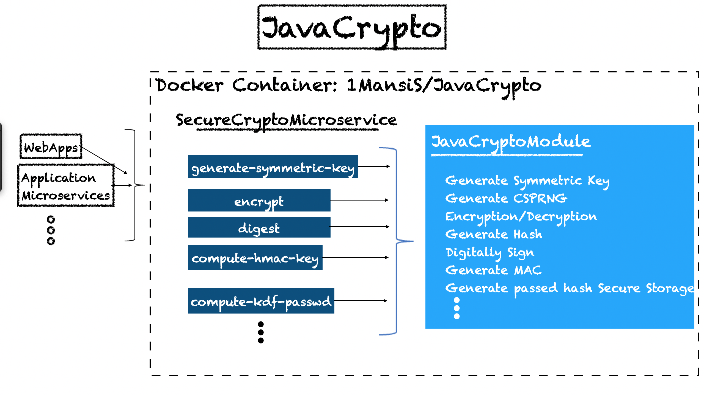

# Overview

JavaCrypto is easy-to-use, light-weight, modern library for all core cryptographic operations needed to build higher-level cryptographic tools. It's a drop-and-hook bundle of APIs responsible for performing various cryptographic primitives in the most secure way possible while using Java Cryptography Architecture (JCA). It includes APIs for:

	- Encryption & Decryption 
	- Hashing
	- Message Authentication Code
	- Digital Signatures
	- Password Storage etc


# Architecture

`JavaCrypto` supports modern design principles and architecture. 



It can be esily-injected using either:

1. **JavaCryptoModule:** This module provides all all of box cryptographic primitives as an API, mainly using Java Cryptography Architecture (JCA). Some of the APIs provided are:

	* Generating a cryptographically secure pseudo random number, in an OS agnostic way
	* Encryption and decryption
	* Calculating message digests
	* Calculating message authentication codes
	* Signing and verifying digital signatures
	* Secured password storage

2 **SecureCryptoMicroservice:** Microservice wrapped around above module which exposes typical cryptographic use cases.

3 **[1MansiS/JavaCrypto docker image](https://hub.docker.com/repository/docker/1mansis/javacrypto):** Easily deployable image in any microservice or cluster environment thru your CI/CD pipeline. This image is auto-published with each new code checkin to this repo via github action. 


## Getting Started

Quickest way to start experimenting with the JavaCrypto's REST APIs is to pull the docker image:

```plaintext
docker pull 1mansis/javacrypto
docker run -p 8080:8080 1mansis/javacrypto
```

## Build Locally

You can directly access the underlying APIs via the `JavaCryptoModule`. To build the module locally, just `git clone` this repository and:

```
cd JavaCryptoModule/SecureJavaCrypto 
gradle clean build
```

If you wish to access the underlying APIs via `SecureCryptoMicroservice`, you can 

```
cd SecureCryptoMicroservice 
gradle clean build
```

### Requirements:

	- Java Version 18
	- Gradle build tool


## Everyday UseCases

No better way to get cracking with any REST API than to use `curl`. Lets look at some everyday usecases using the latest docker image:

### Authentication:

Core of any good authentication system is making sure passwords are stored securely, so that in an unfortunate event of a breach, passwords aren't cracked offline. The most secure way to do this is by using a memory hard Key Derivative Function. Taking away all the complexities of choosing the right algorithm and choosing its secure parameters, below is how a typical Request/Response steps would look like:


1. Generate Salt:

Request:

```plaintext
curl 'http://localhost:8080/compute-salt' -s | json_pp
```

Response:

```plaintext
{
   "base64-salt" : "UIneZVONMIM4nmliROlJkMu4zkJE73TfhvFit1GW0qs="
}
```

Using the salt generated above, compute the password hash to be stored in the database:


2. Compute Hash, using above generated salt

Request:

```
curl 'http://localhost:8080/compute-kdf-passwd' -X POST -H "Content-type: application/json" -s \
-d '{"base64-salt":"UIneZVONMIM4nmliROlJkMu4zkJE73TfhvFit1GW0qs=",
"passwd":"mysupersecretpasswordtobestored!!!"}'| json_pp
```

Response:

```plaintext
{
   "base64-kdf-passwd-hash" : "XdWuZ758kOai3/Mn6PmtVe1bSVtRvedpbO7KpwLFayo=",
   "base64-salt" : "UIneZVONMIM4nmliROlJkMu4zkJE73TfhvFit1GW0qs=",
   "passwd" : "mysupersecretpasswordtobestored!!!"
}
```

### Encryption:

There are often situations where we need to send encrypted information over the wires. Lets see how to take away all the complexities of using the secure Cipher scheme, padding, keying material, initialization vectors etc:


1. Generate Encryption Parameters:

Leaving the default secure choices to the tool, we would need just initialization vector & symmetric key for an encryption scheme. 

Request:

```
curl 'http://localhost:8080/generate-encryption-parameters' -s | json_pp
```

Response:

```plaintext
{
   "base64_iv" : "FVRMdBrqSE7lLYCBkuTLZw==",
   "base64_symmetric_key" : "ZsLQyM8bPqts+DFcFTVhy6WZ+jpw8NDx5oNZHjq5Io4="
}
```

Using Symmetric Key and Initialization Vector generated in above request, lets see how to encrypt a secret message:


2. Encrypt:

Request:

```plaintext
curl 'http://localhost:8080/encrypt' -X POST -H "Content-Type: application/json" -d \
'{"base64_iv" : "FVRMdBrqSE7lLYCBkuTLZw==",
"base64_symmetric_key" : "ZsLQyM8bPqts+DFcFTVhy6WZ+jpw8NDx5oNZHjq5Io4=",
"plain_text":"Hello Crypto World!",
"aad":"localhost"}' -s | json_pp
```

Response:

```plaintext
{
   "aad" : "localhost",
   "base64_cipher_text" : "plMqkDjcqDHkeqvWnuYZH+L6Oysqf/7p4YRNdFrHWz9oqG8=",
   "base64_iv" : "FVRMdBrqSE7lLYCBkuTLZw==",
   "base64_symmetric_key" : "ZsLQyM8bPqts+DFcFTVhy6WZ+jpw8NDx5oNZHjq5Io4=",
   "plain_text" : "Hello Crypto World!"
}
```

3. Decryption:
Similarly, using above keying materials and cipher text, lets decrypt the plaintext back.

Request:

```plaintext
curl 'http://localhost:8080/decrypt' -X POST -H "Content-Type: application/json" \
-d '{"base64_iv":"FVRMdBrqSE7lLYCBkuTLZw==",
    "base64_symmetric_key":"ZsLQyM8bPqts+DFcFTVhy6WZ+jpw8NDx5oNZHjq5Io4=",
"aad":"localhost",
"base64_cipher_text":"plMqkDjcqDHkeqvWnuYZH+L6Oysqf/7p4YRNdFrHWz9oqG8="}' -s | json_pp
```

Response:

```plaintext
{
   "aad" : "localhost",
   "base64_cipher_text" : "plMqkDjcqDHkeqvWnuYZH+L6Oysqf/7p4YRNdFrHWz9oqG8=",
   "base64_iv" : "FVRMdBrqSE7lLYCBkuTLZw==",
   "base64_symmetric_key" : "ZsLQyM8bPqts+DFcFTVhy6WZ+jpw8NDx5oNZHjq5Io4=",
   "plain_text" : "Hello Crypto World!"
}
```


# REST API Docs

While sending REST API requests, you must include `'Content-Type':'application/json'` in the HTTP header.

## Encryption/Decryption
[Encryption Decryption](doc/api/encryption_decryption.md)

## Hashing
[Hashing](doc/api/hashing.md)

## Message Authentication Code
[Message Authentication Code](doc/api/message_authentication_code.md)

## Digital Signatures
[Digital Signatures](doc/api/digital_signature.md)

## Password Storage
[Password Storage](doc/api/password_storage.md)

## Key Management
[Key Management](doc/api/key_management.md)

# LICENSE

JavaCrypto is released under MIT License

Permission is hereby granted, free of charge, to any person obtaining a copy of this software and associated documentation files (the "Software"), to deal in the Software without restriction, including without limitation the rights to use, copy, modify, merge, publish, distribute, sublicense, and/or sell copies of the Software, and to permit persons to whom the Software is furnished to do so, subject to the following conditions:
The above copyright notice and this permission notice shall be included in all copies or substantial portions of the Software.
THE SOFTWARE IS PROVIDED "AS IS", WITHOUT WARRANTY OF ANY KIND, EXPRESS OR IMPLIED, INCLUDING BUT NOT LIMITED TO THE WARRANTIES OF MERCHANTABILITY, FITNESS FOR A PARTICULAR PURPOSE AND NONINFRINGEMENT. IN NO EVENT SHALL THE AUTHORS OR COPYRIGHT HOLDERS BE LIABLE FOR ANY CLAIM, DAMAGES OR OTHER LIABILITY, WHETHER IN AN ACTION OF CONTRACT, TORT OR OTHERWISE, ARISING FROM, OUT OF OR IN CONNECTION WITH THE SOFTWARE OR THE USE OR OTHER DEALINGS IN THE SOFTWARE.

# DISCLAIMER:

JavaCrypto came into existance and matured over time more as a complimenting code reference for Java Crypto blog series and numberous conference talks on this topic. Not accepting any PR/bug reports at the moment. All work done as part of this is a personal project, so direct all complaints to me.
